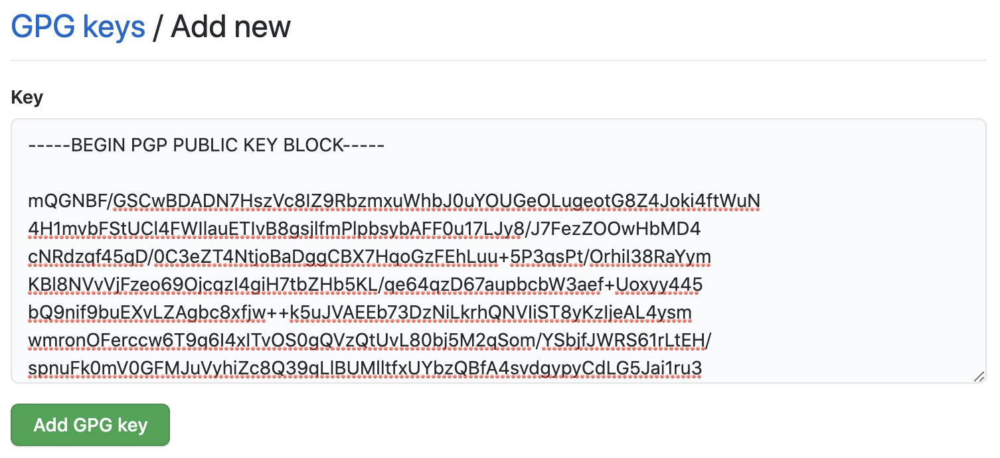
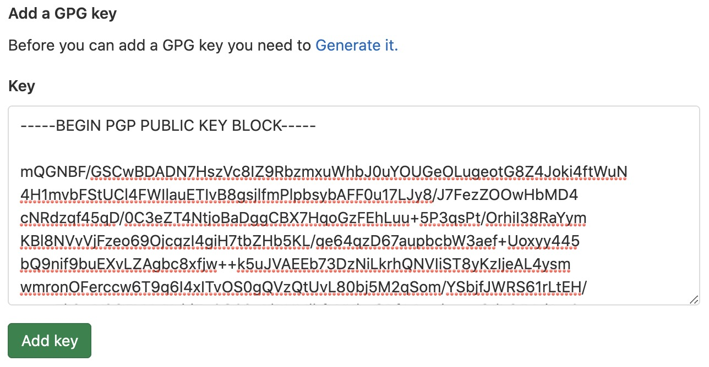

When using git, everybody is able to set any name and email address for their commits by using:

```bash
git config user.name "John Doe"
git config user.email john.doe@example.com
```

So anybody can impersonate you and create commits in your name without your approval. To verify
it's you that made a commit you can sign it with your private PGP key. PGP stands for Pretty Good
Privacy and is an encryption program that allows you to encrypt and sign data using public key
cryptography. By using asymmetric encryption you are holding a private/secret key, that is able to
decrypt/sign data and a public key, that can be distributed to anybody to either encrypt data that
only you should be able to decrypt with your private key or to verify it's you that signed a piece
of data.

So according to the principles of public key cryptography you are the only one that is able to
sign data in your name, because you are the only one holding your private/secret key. Enough
theory let's get started.

## Create a PGP key pair

In order to create a PGP key pair we need a PGP client on our system. In this case we are using
GNU Privacy Guard or GnuPG. You can install it by using a package manger or you can also do it
[by hand](https://gnupg.org/):

```bash
# MacOS
brew install gnupg

# Debian
apt install gpg

# Arch Linux
pacman -S gnupg

# Fedora / CentOS
yum install gpg

# Windows
winget install GnuPG.GnuPG
```

After you've installed GnuPG on your workstation you can create a key pair by running the following
command. Make sure to use the same email address as the one used for your GitHub / GitLab account.

```
$ gpg --gen-key

gpg (GnuPG) 2.2.12; Copyright (C) 2018 Free Software Foundation, Inc.
This is free software: you are free to change and redistribute it.
There is NO WARRANTY, to the extent permitted by law.

gpg: directory '/root/.gnupg' created
gpg: keybox '/root/.gnupg/pubring.kbx' created
Note: Use "gpg --full-generate-key" for a full featured key generation dialog.

GnuPG needs to construct a user ID to identify your key.

Real name: John Doe
Email address: john.doe@example.com
You selected this USER-ID:
    "John Doe <john.doe@example.com>"

Change (N)ame, (E)mail, or (O)kay/(Q)uit? O

We need to generate a lot of random bytes. It is a good idea to perform
some other action (type on the keyboard, move the mouse, utilize the
disks) during the prime generation; this gives the random number
generator a better chance to gain enough entropy.

gpg: /root/.gnupg/trustdb.gpg: trustdb created
gpg: key EBC5077B9E800AAA marked as ultimately trusted
gpg: directory '/root/.gnupg/openpgp-revocs.d' created
gpg: revocation certificate stored as '/root/.gnupg/openpgp-revocs.d/E1D7E4402C4D7765C9D1DF0AEBC5077B9E800AAA.rev'
public and secret key created and signed.

pub   rsa3072 2020-12-01 [SC] [expires: 2022-12-01]
      E1D7E4402C4D7765C9D1DF0AEBC5077B9E800AAA
uid                      John Doe <john.doe@example.com>
sub   rsa3072 2020-12-01 [E] [expires: 2022-12-01]
```

You can also run `gpg --full-generate-key` to get advanced options for the key generation like
the key size, expiration date, ...

## Configure Git to use the PGP key

First make sure that your name and email address are set in the git config. For that you can run
`git config --list`. If they are not set or if you want to override them run:

```bash
git config --global user.name "John Doe"
git config --global user.email john.doe@example.com
```

After that you need to get the id of your PGP key so that it can be specified in the git config.
To get the id run:

```
$ gpg --list-keys

gpg: checking the trustdb
gpg: marginals needed: 3  completes needed: 1  trust model: pgp
gpg: depth: 0  valid:   1  signed:   0  trust: 0-, 0q, 0n, 0m, 0f, 1u
gpg: next trustdb check due at 2022-12-01
/root/.gnupg/pubring.kbx
------------------------
pub   rsa3072 2020-12-01 [SC] [expires: 2022-12-01]
      E1D7E4402C4D7765C9D1DF0AEBC5077B9E800AAA
uid           [ultimate] John Doe <john.doe@example.com>
sub   rsa3072 2020-12-01 [E] [expires: 2022-12-01]
```

To set the signing key and also the gpg executable run:

```bash
# Set signing key
git config --global user.signingkey E1D7E4402C4D7765C9D1DF0AEBC5077B9E800AAA

# Set gpg executable
git config --global gpg.program gpg
```

## Configure GitHub / GitLab

Next you need to configure your Git-repository manager (GitHub / GitLab). GitHub / GitLab must be
aware that the key that is being used to sign commits is actually yours. Therefore you need to
copy your public key (that can be shared with anyone) and paste it in your account settings.

To get the public key run:

```
$ gpg --export --armour john.doe@example.com

-----BEGIN PGP PUBLIC KEY BLOCK-----

mQGNBF/GSCwBDADN7HszVc8IZ9RbzmxuWhbJ0uYOUGeOLugeotG8Z4Joki4ftWuN
4H1mvbFStUCl4FWIlauETIvB8gsjlfmPlpbsybAFF0u17LJy8/J7FezZOOwHbMD4
cNRdzqf45qD/0C3eZT4NtjoBaDggCBX7HqoGzFEhLuu+5P3qsPt/OrhiI38RaYym
KBl8NVvVjFzeo69OjcqzI4giH7tbZHb5KL/qe64qzD67aupbcbW3aef+Uoxyy445
bQ9nif9buEXvLZAgbc8xfjw++k5uJVAEEb73DzNiLkrhQNVIiST8yKzIjeAL4ysm
wmronOFerccw6T9q6I4xITvOS0gQVzQtUvL80bj5M2qSom/YSbjfJWRS61rLtEH/
spnuFk0mV0GFMJuVyhiZc8Q39qLlBUMlltfxUYbzQBfA4svdgypyCdLG5Jai1ru3
bcAMBb5N6Flmt/ht9Q7hXZqeuI6RZWx7Uut9ghCA6vsx14rpTeCrCTLAGJB0AT1p
DWeUxS/p2kAZA5kAEQEAAbQoRG9taW5payBBc2NoYmFjaGVyIDxhc2NoaTEyMzFA
Z21haWwuY29tPokB1AQTAQoAPhYhBOHX5EAsTXdlydHfCuvFB3uegAqqBQJfxkgs
AhsDBQkDwmcABQsJCAcCBhUKCQgLAgQWAgMBAh4BAheAAAoJEOvFB3uegAqqrOQL
/R2mLbKcNTEcrd88VIsUTSb5LA1cckML29C3It2wmw3u1YqsaQIPewD/EM9oqaUl
eBexnRY06TuZVuwpCvnsxAB5+vX/ASiKOcuU2FTPLIGmwObZa8j3y7Uw3g4cD9Bs
kV03tIjULXZSwdBV83sBN7M01JmMe2GfrAVz4k6i9GYZEzRxL+gh0ltX2q9r2537
5eTECDTeKq2vq9yY+Nt+R1D9PQPNF5gd/1XSvy4K6yOkuJ3/DOMAHcPKcnpn78rC
hiKN0x7+c5Seld0djDq9AtfayN10hWo4SWa7nmt+tuNyEvI/Sy1oBMflg0oVe5jm
WaIBAQhvM2b/W/OWF8iPkNUfTmiAQWIqEE7/t5uj6ncoEp7D3BjVWhJFJGVrLhXd
4us1n1pk14uuun5uEadqeTl10KlHg0ZOfYdTVT7acq749oZVUyXDIHpPMrc2pqA4
rS7UXF0x2opBYFYtFoqUntfd0iWCeOuLaFjzT5bDLo/aVs5mr5iecPtx1t9ZPrvj
SLkBjQRfxkgsAQwAtuxw+0fLuWHMgh//5+cWX3tMygZi5BiXtOieQSGMyDryNum8
DFGxCzrCY4JEY4cphbgq3sCLfc/wKCP/lYOh9T3Z5wIU5BZtEa8HSAxzN/9hfo2/
1+DeAxBPBJFZSh/iDtyV/nG0KiFbyeCB8hzLghGbA2afGr4WDlouas5zgbVH3t60
8IuSTBNYJ/NCFNfKC66O8lUEoJHdA3k6HM1PmZ4ToqH1oWui1SbAJQ4FEw5QHyBS
NiPAXHGhc57xl86EpuNO3AzDqpX3ov+P9kl7Tj6IUOoDb3RkYpLe4JoRATjb3HNq
HzIj7iznTO0gi/7gQsIMSaL3X1qbeiP1XzZaY4DNTLUAd/42LqE0V+f7RIqMZEsY
8MdKt2ONOXRYB11ZadjUFtCz3bLoqJUuPSJcwKFvJLI/j6xGTty/nBAQ/nXt4QLw
hWg9BGYOz9e28iWQIdOJPPOVJ1m6tploJlzCampqnpnUizxIoc65n0GMYUgvtf99
2ttx/AmLVMujMqwDABEBAAGJAbwEGAEKACYWIQTh1+RALE13ZcnR3wrrxQd7noAK
qgUCX8ZILAIbDAUJA8JnAAAKCRDrxQd7noAKqiOdDACkwxrwxpq9KqpsYuqkV/av
accWVLDZ1SGQ4P2lWV07AwShUcJTN7pPjZKull6dOPrFb0Bmm2DXC9DlPn/rme6d
MqmyxG1PfWhx1wV3BLubpXjthQziTtsgscds/Fyk21LSahox/XwXsc1+O76vWV+o
Kmo3op2t5frR7tacXv1YG+23JXJooupA0C/1vfPfQOF8g0Y2PDuUb1Pi16QiXjGR
M3aDJ6/f2cS3BvmokiUISYRerxIumLYl0IZUPfV9yrPaBHKa+eUJQfGEtLR/glea
XLGexYeYOLHrvMvVyo7UVn7VDVXYpddZNTrc69x83l7oqWVJjykqdANcc0IVvzn4
PtmnJgdM4c+i1rURRG4mVFDgT0RNzKOId77D0pO7zVPtO2M/Y/7sYmxQzBXm78eG
1mXsDHfP9vr2/7HcPdf1gA9o0xhScuGDOOMo7hZnH8mqVCkCrzLjIXVk8mt6TAA0
7q4ju/ZYd8wZGef7G5asmcbOlwt6iKooF4AFpQUU4fY=
=ASke
-----END PGP PUBLIC KEY BLOCK-----
```

### GitHub

Go to <https://github.com/settings/keys> and click on "New GPG key". Then copy your public key
(make sure to also include the beginning and end line) and paste it in the text field on GitHub.



### GitLab

Go to <https://gitlab.com/-/profile/gpg_keys>. Then copy your key (make sure to also include the
beginning and end line) and paste it in the text field on GitLab.



## Testing

After configuring your Git-repository manager you can test if it works by doing a test commit.
Execute the following commands to create a test setup where you can check if everything works
as expected.

```bash
# Create test directory
mkdir /tmp/git-signed-commits
cd /tmp/git-signed-commits

# Initialize git repository
git init

# Add test file
echo test > test.txt

# Stage file
git add test.txt
```

Now you can commit the changes but don't forget to use the argument `-S` to sign the commit.

```
$ git commit -S -m "Initial commit"

error: gpg failed to sign the data
fatal: failed to write commit object
```

If you are getting the same error run the following:

```bash
# Export tty
export GPG_TTY=$(tty)

# Add to bashrc
echo "export GPG_TTY=$(tty)" >> ~/.bashrc
```

After that you can try running `git commit` again and it should work fine:

```
$ git commit -S -m "Initial commit"

[master (root-commit) 4ff4d29] Initial commit
 1 file changed, 1 insertion(+)
 create mode 100644 test.txt
```

To test if the verification on GitHub / GitLab works add a remote repository you created on
GitHub / GitLab (it should be a new repository to prevent any unwanted errors for this test)
and push the test commit to it.

```bash
# Add remote (only add the one you need)
git remote add github https://github.com/johndoe/test.git
git remote add gitlab https://gitlab.com/johndoe/test.git

# Push to remote
git push github master
git push gitlab master
```

If you take a look at your commit on GitHub / GitLab you will see that the commit is verified,
because it got signed with your PGP key.


